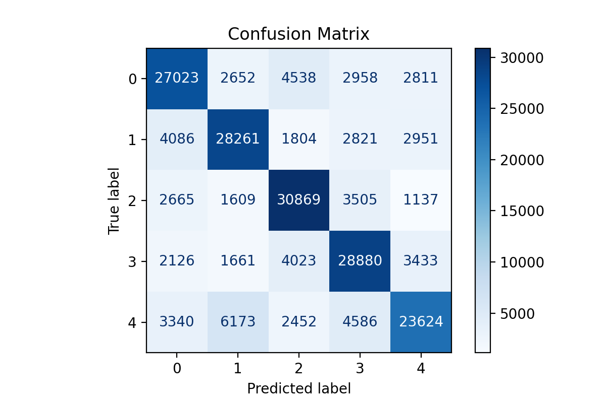
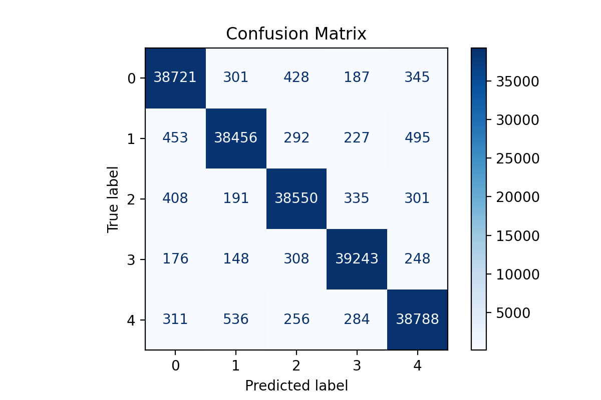

# pyspark_code_example
version: spark 3.3.1 hadoop 2.7 python 3.9 Java 17 pyspark 3.3.1
## pyspark regressor 
linear regression in pyspark LinearRegression model
## pyspark_classification 
classification by using pyspark random forest tree. The test data has 20 input feature and 5 output class. The test dataset is synthesized by "make_classification" from sklearn. The maximum number of tree iis 10 and the maximum depth is 10. It reports a error when using larger number of tree and increase the depth. 

## py_spark_MultilayerPerceptronClassifier 
multi-layer neural network by pyspark. The test data has 20 input feature and 5 output class. The test dataset is synthesized by "make_classification" from sklearn. The pyspark doesn't support the GPU learn on MultilayerPerceptronClassifier yet and it is hard to perform large NN.

